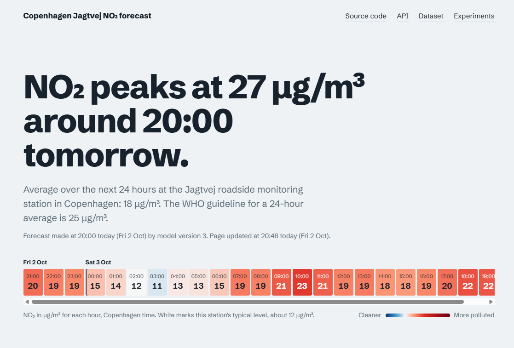
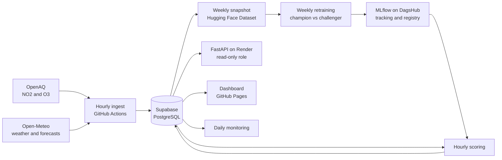

[](https://github.com/kjibran/mlops-air-quality-forecast/actions/workflows/ci.yml)

# Copenhagen NO₂ forecast: an end-to-end MLOps pipeline

Hourly forecasts of nitrogen dioxide (NO₂) for the next 24 hours at the Jagtvej roadside monitoring station in Copenhagen. Everything runs automatically on free infrastructure, at no running cost: data ingestion, versioned snapshots, weekly retraining with automatic model promotion, hourly forecasts, monitoring, and a public dashboard.

[](https://kjibran.github.io/mlops-air-quality-forecast/)

**Live dashboard:** https://kjibran.github.io/mlops-air-quality-forecast/
**Forecast API:** https://no2-forecast-api.onrender.com/docs
**Versioned dataset:** https://huggingface.co/datasets/khajlk/copenhagen-air-quality-hourly
**Experiments and model registry:** https://dagshub.com/kjibran/mlops-air-quality-forecast/experiments

The API runs on a free tier, so the first request after idle time can take up to a minute. The dashboard is a static site and always loads instantly.

## What this project demonstrates

- **Data engineering:** scheduled, idempotent ingestion from two public APIs into PostgreSQL, with versioned migrations, pagination, retries with backoff, and incremental loads.
- **Data quality work:** validating an external data source, finding a mislabelled API endpoint and an implausible data period, and documenting each decision.
- **Time series modelling:** leakage-safe feature engineering with explicit data latency, time-based evaluation, and honest comparison against baselines.
- **MLOps:** experiment tracking and a model registry in MLflow, data lineage through tagged snapshots, champion and challenger promotion, scheduled retraining, monitoring, and drift detection.
- **Serving:** batch scoring, a FastAPI service behind a read-only database role, Docker, and CI/CD that deploys only after tests pass.
- **Domain knowledge:** physically motivated features and checks, from local-time traffic patterns to seasonally aware drift thresholds.

## Results

All errors are mean absolute error (MAE) in µg/m³ on the test year, October 2025 to October 2026, never seen during training.

| Method | MAE | Better than persistence |
|---|---|---|
| Typical value for that hour and weekday | 8.58 | |
| Same hour last week | 8.83 | |
| Persistence (latest value continues) | 8.02 | |
| LightGBM with measured weather (upper bound) | 4.94 | 38% |
| **LightGBM with forecast weather (realistic)** | **5.59** | **30%** |

The realistic result is the one that counts. The upper bound uses weather that was actually observed, which no live forecast can know in advance. Feeding the model archived Day 1 weather forecasts instead shows what the service really achieves: about 30% better than persistence overall, 16% at one hour ahead, and 30 to 35% at 6 to 24 hours ahead.

Live accuracy is measured continuously against new measurements and shown on the dashboard.

### Model history

| Version | What changed | Outcome |
|---|---|---|
| v1 | Registered by mistake from the measured-weather evaluation run. Same model weights as v2 | Replaced by v2 so the registry links to the realistic evaluation |
| v2 | First production model, trained on data up to October 2025 | Initial champion. Realistic test MAE 5.59, as in the table above |
| v3 | Retrained on data up to August 2026 | **Promoted.** MAE 4.93 vs 5.45 for v2 on the same recent 60 days |
| v4 | Added urban background NO₂ and ozone from a second station | **Rejected.** Only 0.5% better, below the 2% promotion threshold |

v3 was promoted automatically. NO₂ at the station has declined year on year, and a model trained on recent data has learned the lower current levels. v4 was a physically motivated idea that did not earn its place: the station's own recent history already carries most of the information the background station adds.

Errors from different rows are not directly comparable, because they come from different evaluation periods. The results table evaluates v2 on the full test year. Promotion decisions only ever compare two models on the same days with the same forecast weather. The "in testing" figure on the dashboard is the current champion's error on its own 60-day evaluation window.

## Architecture



Four scheduled workflows run the system:

| Workflow | When | What it does |
|---|---|---|
| Hourly pipeline | Twice an hour | Ingests NO₂, background pollutants and weather, scores the next 24 hours with the champion model, rebuilds the dashboard |
| Weekly data snapshot | Monday 03:00 UTC | Exports the database to Parquet and tags a new version on Hugging Face |
| Weekly retraining | After each snapshot | Trains a challenger, compares it with the champion, promotes it if clearly better, and writes a drift report |
| Daily monitoring | Every day | Checks data freshness and live accuracy, and fails loudly if something is wrong |

## How it works

### Data

- **Target:** hourly NO₂ at the Jagtvej roadside station (OpenAQ location 5177), from the European Environment Agency via OpenAQ.
- **Weather:** temperature, humidity, wind speed and direction from Open-Meteo, both as measured history and as archived Day 1 forecasts.
- **Background station:** NO₂ and ozone at an urban background station (OpenAQ location 5170), used by the v4 challenger.

Ingestion re-fetches a sliding window of recent days every hour. Every table has a primary key, and every write is an upsert, so repeated or overlapping runs never create duplicates. That makes the pipeline safe to re-run after any failure.

### Data quality findings

- **An API endpoint mislabelled years.** OpenAQ's yearly summary was shifted by one year relative to the hourly data. I found it by recomputing yearly statistics from the raw hours in the database.
- **NO₂ before November 2019 is implausible.** Monthly means of 0.5 to 5 µg/m³ at a roadside station, then a clean step to plausible levels in November 2019. That pattern points to a change in data processing, so training starts on 1 November 2019. The raw data stays in the database untouched.
- **NO₂ is almost entirely missing from March to November 2022.** Kept as missing, never filled with invented values.
- **Boundary layer height is missing from January to June 2024** in the Open-Meteo archive, including for the ERA5 model, and it is not available as a historical forecast at all. It is excluded from production models. Dropping it costs almost nothing (MAE 4.99 instead of 4.94), because hour of day, temperature and wind carry most of the same information.
- **NO as a traffic proxy was rejected.** It would be a strong feature, but the sensor stopped reporting in March 2024. A feature that is not available when the live model makes a forecast cannot be used.

### Features and leakage prevention

Each training row is one forecast: made at an issue time, for a target hour 1 to 24 hours later.

- **Pollutant data arrives about three hours late.** Features only use values up to the issue time minus three hours, exactly as in production. "Same hour yesterday" is left empty for horizons beyond 21 hours, because that value would not have arrived yet.
- **Calendar features use Copenhagen local time,** because traffic follows local clocks through daylight saving changes.
- **Wind direction is encoded as sine and cosine,** so that 359° and 1° are close together.

Tests prove these rules hold. A synthetic series where each value equals its own hour position makes any use of future data detectable. Another test checks that training and live scoring produce identical features from the same data, since both call one shared function.

### Model and evaluation

LightGBM with an absolute-error objective, which matches the evaluation metric. Evaluation is strictly time-based. Training rows must have their target before the test period starts, so no training target leaks into it.

### The MLOps loop

- **Data lineage:** training always reads a tagged snapshot from Hugging Face, and every MLflow run records the snapshot tag and the git commit. Any model can be traced to the exact data and code that produced it.
- **Model registry:** the production model holds the `champion` alias in the MLflow registry. Scoring always loads the current champion, so promotion needs no code change and no redeploy.
- **Champion vs challenger:** each week a challenger is trained on the latest snapshot. Both models are evaluated on the same recent 60 days with the same forecast weather. The challenger is promoted only if it is at least 2% better. Every decision is logged.
- **Monitoring:** a daily check verifies that measurements and forecasts are fresh, and that the 7-day live error stays below 1.5 times the champion's test error. Each check is logged to MLflow, which builds a history of data delay and live accuracy.
- **Drift detection:** a weekly report compares recent inputs with the same season in earlier years using the Population Stability Index. Textbook thresholds do not work for weather. Weather comes in multi-day regimes, so normal weeks routinely reach PSI values of 1.6 to 4.8, far above the usual 0.25 alarm level. The report instead flags a week only if it is more unusual than 95% of past weeks.

### Serving

Forecasts are computed in batch every hour and stored in the database. The API and the dashboard only read them.

- The **API** connects with a dedicated read-only database role. Even a compromised API could not change or delete data.
- The **dashboard** is a static site rebuilt by the hourly pipeline, so it loads instantly and cannot go down with the API. It is only republished when ingestion, scoring and export all succeed.

## Design decisions and trade-offs

- **Supabase for operational data, Hugging Face for frozen snapshots.** The live database changes every hour. Training needs fixed versions for reproducibility.
- **Batch scoring instead of computing forecasts per request.** The API stays small and fast, and every forecast is stored for later verification.
- **An additive table for background pollutants** instead of redesigning the working schema. Production depended on the existing tables, so the change extends rather than rebuilds.
- **A 2% promotion threshold.** Smaller differences are mostly noise, and switching models for nothing makes production less predictable.
- **The Docker image installs all project dependencies,** although the API needs only a few. Simpler to maintain, at the cost of a larger image. Splitting dependencies per component is a possible refinement.

## Limitations and next steps

- One station only. The model is not meant to transfer to other locations without retraining.
- The realistic evaluation uses Day 1 forecasts for all horizons, so it is slightly pessimistic for short horizons, where the live service has fresher forecasts.
- No prediction for the hour in progress. A horizon 0 nowcast would need its own training and evaluation.
- No uncertainty model. The dashboard shows the typical error as a band, not a calibrated interval.
- GitHub's scheduled triggers are best effort and can be delayed or dropped, so the pipeline runs twice an hour. Every run is idempotent, so the extra run is harmless and covers a dropped one.
- Scheduled GitHub workflows pause in repositories without activity for 60 days.
- The background station features could matter during outages at the main station. Evaluating on periods with gaps in the street data would test that.

## About NO₂

Nitrogen dioxide is one of the main air pollutants in cities, and road traffic is one of its major sources. It irritates the airways and can worsen asthma. The WHO guideline for a 24-hour average is 25 µg/m³. Levels change hour by hour with traffic and weather, which makes it a natural target for short-term forecasting.

## Repository structure

```
src/mlops_air_quality_forecast/
    config.py        settings from environment variables
    openaq.py        OpenAQ client with pagination and retries
    openmeteo.py     weather history, archived forecasts and live forecasts
    store.py         database reads and idempotent writes
    snapshot.py      versioned Parquet snapshots on Hugging Face
    data.py          loading snapshots by tag
    features.py      shared feature logic for training and scoring
    evaluation.py    time-based split, baselines and metrics
    model.py         LightGBM training and feature sets
    retraining.py    champion vs challenger and promotion
    scoring.py       hourly batch forecasts with the champion
    monitoring.py    freshness and live accuracy checks
    drift.py         seasonal PSI drift report
    api.py           FastAPI service
scripts/             entry points for each job
sql/                 database migrations
site/                dashboard
tests/               leakage, consistency and unit tests
notebooks/           data exploration
docs/                images for this README
```

## Run locally

Requires [uv](https://docs.astral.sh/uv/) and access to the external services listed in `.env.example`.

```bash
git clone https://github.com/kjibran/mlops-air-quality-forecast.git
cd mlops-air-quality-forecast
cp .env.example .env    # then fill in your own keys
uv sync
uv run pytest
uv run --env-file .env python scripts/train.py
```

## Tech stack

Python 3.12, pandas, LightGBM, scikit-learn, MLflow, FastAPI, PostgreSQL (Supabase), Hugging Face Datasets, DagsHub, Docker, GitHub Actions, GitHub Pages, Render, Chart.js, uv, ruff, pytest.

## Data sources

- NO₂ and ozone: European Environment Agency, via [OpenAQ](https://openaq.org).
- Weather: [Open-Meteo](https://open-meteo.com), licensed under CC BY 4.0.

## Licence

The code is released under the MIT licence, see [LICENSE](LICENSE). The data keeps the terms of its original sources listed above.
